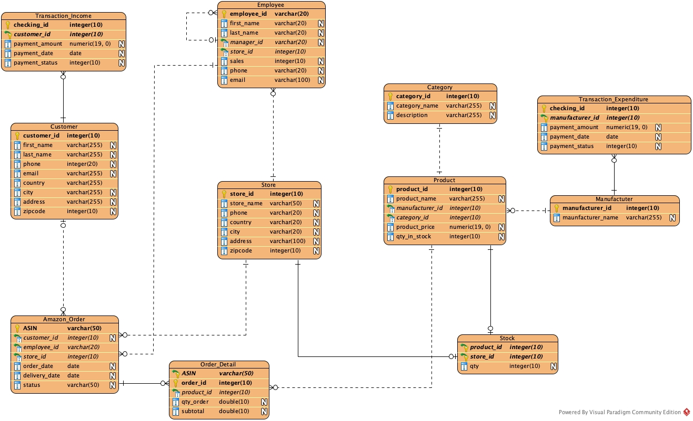

```{r setup, include=FALSE}
knitr::opts_chunk$set(echo = TRUE)
```

# Design Purpose
As consumer behavior shifts during the COVID pandemic, new roles in e-commerce emerge. Many businesses began to market their products online in order to meet the needs of their customers. Because Amazon has the world's largest ecommerce platform, many retailers want to sell their products through the Amazon online store. But how do they manage their product and keep their budget under control? The goal of an ecommerce company database management system is to assist every retailer in selling their products through Amazon platform.

1. Define the information content of your database.

(a) Define a set of entities and appropriate attributes for each entity.
 Minimum 10 entities.

Entities: Transaction_Income, Customer, Amazon_Order, Employee, Store, Order_Detail, Category, Product, Transaction_Expenditure, Manufacturer, Stock

Attributes: Please see the following ER diagram for more information. That is, the columns in each entity.

(b) Define a set of relationships that might exist between/among entities and attributes. Such
 relationships may include one-to-one, one-to-many and many-to-many associations.

- Customer and Amazon_Order have a 1-M relationship as one customer can place multiple orders on Amazon.
- Amazon_Order and Store have a M-1 relationship as multiple orders can be shipped by one store.
- Amazon_Order and Order_Detail have a 1-M relationship as one ASIN (the primary key in Amazon_Order) can be included multiple order_id.
- Amazon_Order and Employee have an M-1 relationship because one employee can manage multiple ASINs.

(c)-Define a set of constraints that may be imposed on data.

- **Not null and primary key constraints**: The primary key of each entity cannot have a null value. It prevents null values from being entered into one or more columns within a table. On the following SQL sessions, I will show how to create tables with constraints that the primary key has no null value.

- **Foreign key constraint**: It constraint states that the key can only contain values from the referenced main key, ensuring the referential integrity of data linked by the two keys. For instance, set “foreign key (store_id) references Store (store_id)” as a foreign key constraint when you create a table.

2. Define an E-R Diagram for your database design.

# Entity Relationship Diagram (ERD) 




3. Define a relational schema for your database design. Make sure that you have both one-to-many and many-to-many associations.

(a) Define one or more realistic key(s) for every relation scheme. Use both simple and composite keys.
(b) Define a realistic set of Functional / Multi-Valued Dependencies (when appropriate) for every
relation scheme.
(c) Check whether your relational schema is in 2NF, 3NF, BCNF, 4NF.
(d) Put your relational schema in the highest normal form that is possible. Note that, every relation scheme should be in a specific normal form in order to have the relational schema in that normal form.

NOTE: Please provide a detailed explanation for every question when appropriate. 

4. Implementation: Create your database using MySQL, or… to Perform the following operations. Create 4 tables from your database project that are connected/linked together and insert few dummy records
into these tables. **Then use these tables to answer the following queries**.

(A) You are required to execute SQL queries that include the following operations. For each query, provide the SQL statements along with the output. For each of the following, try different SQL statements (i.e., using one relation, more than one relations,...)

I'm going to create four tables: Employee, Store, Order_Detail, and Amazon_Order with 6 tuples in each entity.

# Create a Database

    create database if not exists ecomDB;
    use ecomDB;
  
# Create Tables
## Store Entity

    create table if not exists Store (
    store_id int not null primary key,
    store_name varchar(50) not null,
    phone varchar(20),
    country varchar(20),
    city varchar(20),
    address varchar(100),
    zipcode int
    );
    
## Employee Entity

    create table if not exists Employee (
    employee_id varchar(20) not null primary key,
    first_name varchar(20) not null,
    last_name varchar(20) not null,
    manager_id varchar(20),
    store_id int,
    sales int,
    phone varchar(20),
    email varchar(100) not null unique,
    foreign key (manager_id) references Employee (employee_id), 
    foreign key (store_id) references Store (store_id)
    );
    
## Amazon_Order Entity

    create table if not exists Amazon_Order (
    ASIN varchar(50) not null primary key,
    customer_id int,
    employee_id varchar(20),
    store_id int,
    order_date date,
    delivery_date date,
    status varchar(50),
    foreign key (employee_id) references Employee (employee_id), 
    foreign key (store_id) references Store (store_id) 
    );
    
## Order_Detail Entity

    create table if not exists Order_Detail (
    ASIN varchar(50) not null,
    order_id int not null,
    product_id int,
    qty_order double,
    subtotal double, 
    PRIMARY KEY (ASIN, order_id) 
    );
    
# Populating the Tables
## Store

    insert into Store values(1, 'Cable Master', '(617)-3332634',
    'USA', 'Washingtion DC', '4400 Massachusetts Ave NW, Washington, DC 20016', 20006);
    insert into Store values(2, 'CC Connector', '(520)-1234567',
    'USA', 'New York City', '20 W 34th St, New York, NY 10001', 10001);
    insert into Store values(3, 'Nerdy Computer', '(123)-6969453',
    'USA', 'San Francisco', '5630 Bay St, Emeryville, CA 94608', 94608);
    insert into Store values(4, 'HD DVD King', '(781)-4226358',
    'USA', 'Las Vegas', '3400 S Las Vegas Blvd, Las Vegas, NV 89109', 89109);
    insert into Store values(5, 'Music You And Me', '(513)-4234567',
    'Canada', 'Laval', '3003 Boulevard le Carrefour, Laval, QC H7T 1C7', 12345);
    insert into Store values(6, 'Super Drone', '(202)-4995340',
    'USA', 'Boston', '150 Morrissey Blvd, Boston, MA 02125', 02125);
    select * from Store;


**store_id	store_name	phone	country	city	address	zipcode**\
1	Cable Master	(617)-3332634	USA	Washingtion DC	4400 Massachusetts Ave NW, Washington, DC 20016	20006\
2	CC Connector	(520)-1234567	USA	New York City	20 W 34th St, New York, NY 10001	10001\
3	Nerdy Computer	(123)-6969453	USA	San Francisco	5630 Bay St, Emeryville, CA 94608	94608\
4	HD DVD King	(781)-4226358	USA	Las Vegas	3400 S Las Vegas Blvd, Las Vegas, NV 89109	89109\
5	Music You And Me	(513)-4234567	Canada	Laval	3003 Boulevard le Carrefour, Laval, QC H7T 1C7	12345\
6	Super Drone	(202)-4995340	USA	Boston	150 Morrissey Blvd, Boston, MA 02125	2125\

## Employee

    insert into Employee values('HQ001', 'Yunting', 'Chiu',
    NULL,  001, 3000, '(426)-888-9453', 'yc6705a@american.edu');
    insert into Employee values('HQ002', 'Yi', 'Ma',
    ''HQ001', 002, 50000, '(123)-456-7890', 'yimama@georgetown.edu');
    insert into Employee values('HQ003', 'Vitalik', 'Buterin',
    'HQ001', 003, 70000, '(113)-456-7330', 'etherum@google.com');
    insert into Employee values('HQ004', 'Tracey', 'Brown',
    'HQ002', 003, 60000, '(223)-439-2267', 'ada@yahoo.com');
    insert into Employee values('MARS001', 'Elon', 'Musk',
    'HQ001', 001, 9000000, '(998)-426-6969', 'mars@tesla.com');
    insert into Employee values('MARS002', 'Andrew', 'Wang',
    'MARS001', 002, 48850, '(784)-345-3926', 'wonderful@spacex.com');
    select * from Employee;

**employee_id	first_name	last_name	manager_id	store_id	sales	phone	email**\
HQ001	Yunting	Chiu		1	3000	(426)-888-9453	yc6705a@american.edu\
HQ002	Yi	Ma	HQ001	2	50000	(123)-456-7890	yimama@georgetown.edu\
HQ003	Vitalik	Buterin	HQ001	3	70000	(113)-456-7330	etherum@google.com\
HQ004	Tracey	Brown	HQ002	3	60000	(223)-439-2267	ada@yahoo.com\
MARS001	Elon	Musk	HQ001	1	9000000	(998)-426-6969	mars@tesla.com\
MARS002	Andrew	Wang	MARS001	2	48850	(784)-345-3926	wonderful@spacex.com\

## Amazon_Order

    insert into Amazon_Order values('B014I8T0YQ', 1, 'HQ001', 1,
    '2018-06-20', '2018-06-23', 'Shipped');
    insert into Amazon_Order values('BB07TVK1V59', 1, 'HQ001', 1,
    '2018-06-20', '2018-06-22', 'Shipped');
    insert into Amazon_Order values('B093PQMWHF', 2, 'MARS001', 3,
    \'2019-03-05', '2019-03-30', 'Shipped');
    insert into Amazon_Order values('B094QQMWHF', 3, 'MARS001', 3,
    '2021-06-16', '2021-07-25', 'Unshipped');
    insert into Amazon_Order values('B07YFCD354', 4, 'HQ002', 2,
    '2020-05-18', '2020-05-22', 'Shipped');
    insert into Amazon_Order values('B01IQN17A4', 5, 'HQ003', 2,
    '2021-06-15', '2025-05-12', 'Unshipped');
    select * from Amazon_Order;

**ASIN	customer_id	employee_id	store_id	order_date	delivery_date	status**\
B014I8T0YQ	1	HQ001	1	2018-06-20	2018-06-23	Shipped\
B01IQN17A4	5	HQ003	2	2021-06-15	2025-05-12	Unshipped\
B07YFCD354	4	HQ002	2	2020-05-18	2020-05-22	Shipped\
B093PQMWHF	2	MARS001	3	2019-03-05	2019-03-30	Shipped\
B094QQMWHF	3	MARS001	3	2021-06-16	2021-07-25	Unshipped\
BB07TVK1V59	1	HQ001	1	2018-06-20	2018-06-22	Shipped\

## Order_Detail

    insert into Order_Detail values('B014I8T0YQ', 1, 1, 40, 3400);
    insert into Order_Detail values('BB07TVK1V59', 2, 2, 30, 6000);
    insert into Order_Detail values('B093PQMWHF', 3, 3, 100, 40000);
    insert into Order_Detail values('B094QQMWHF', 4, 4, 50, 4000);
    insert into Order_Detail values('B07YFCD354', 5, 5, 60, 20000);
    insert into Order_Detail values('B01IQN17A4', 6, 6, 5, 39500);
    select * from Order_Detail;
    
**ASIN	order_id	product_id	qty_order	subtotal**\
B014I8T0YQ	1	1	40	3400\
B01IQN17A4	6	6	5	39500\
B07YFCD354	5	5	60	20000\
B093PQMWHF	3	3	100	40000\
B094QQMWHF	4	4	50	4000\
BB07TVK1V59	2	2	30	6000\


# Select Query
## select involving one/more conditions in Where Clause 

*Q: Which ASIN is from Cable Master?*

    select ASIN from Amazon_Order A inner join Store S
    on A.store_id = S.store_id 
    where store_name  = "Cable Master";

**ASIN**\
B014I8T0YQ\
BB07TVK1V59\

## select with aggregate functions (i.e., SUM,MIN,MAX,AVG,COUNT)

*Q: Look at the average sales for each store.*

    select store_name, round(avg(sales), 2) from Employee E inner join Store S
    on E.store_id = S.store_id
    group by E.store_id

**store_name	avgSales**\
Cable Master	4501500.00\
CC Connector	49425.00\
Nerdy Computer	65000.00\

## select with Having, Group By, Order By clause

*Q: I would like to confirm that the order status has shipped more than one order.*

    select status, count(*) as cnt from Amazon_Order
    group by status
    having count(*) > 1
    order by count(*) desc;

**status	cnt**\
Shipped	4\
Unshipped	2\


## Nested Select

*Q: Find the ASINs which is from the Mars office.*
    
    select ASIN from Amazon_Order where employee_id in (
    	select employee_id from Employee where employee_id like "MARS%");

**ASIN**\
B093PQMWHF\
B094QQMWHF\

## select involving the Union operation

*Q: find all store ID in the database.*
    
    (select store_id from Employee)
    union
    (select store_id from Store)
    union
    (select store_id from Amazon_Order);
    
**store_id**\
1\
2\
3\
4\
5\
6\


# Insert Query

## Insert one tuple into a table (for 2 tables, just add 3 records for each table)

*Q: insert three tuples into a Order_Detail table*

### Before the query

**ASIN**\
B01IQN17A4\
B07YFCD354\
B093PQMWHF\
B094QQMWHF\
BB07TVK1V59\

### After the query

    insert into Order_Detail values('B014I8T0YQ', 6, 1, 20, 1700);
    insert into Order_Detail values('B014I8T0YQ', 7, 1, 10, 850);
    insert into Order_Detail values('B014I8T0YQ', 8, 1, 40, 3400);
    select ASIN from Order_Detail;

**ASIN**\
B014I8T0YQ\
B014I8T0YQ\
B014I8T0YQ\
B01IQN17A4\
B07YFCD354\
B093PQMWHF\
B094QQMWHF\
BB07TVK1V59\

*Q: insert three tuples into a Employee table*

### Before the Query

**first_name	last_name**\
Yunting	Chiu\
Yi	Ma\
Vitalik	Buterin\
Tracey	Brown\
Elon	Musk\
Andrew	Wang\

### After the Query

    insert into Employee values('HQ005', 'Doge', 'Brown', 
    'HQ002',  003, 70000, '(858)-838-9123', 'dogetothemoon@american.edu');
    insert into Employee values('HQ006', 'Barry', 'Smith', 
    ''HQ001', 001, 45000, '(432)-456-7890', 'noschool@lol.edu');
    insert into Employee values('Earth', 'Mother', 'Ground', 
    'HQ001', 002, 58990, '(222)-333-8888', 'googleearth@apple.com');
    select first_name, last_name from Employee;
    
**first_name	last_name**\
Mother	Ground\
Yunting	Chiu\
Yi	Ma\
Vitalik	Buterin\
Tracey	Brown\
Doge	Brown\
Barry	Smith\
Elon	Musk\
Andrew	Wang\

*Q: insert three tuples with a specific attribute*

### Before the Query

**ASIN	customer_id	employee_id	store_id	order_date	delivery_date	status**\
B014I8T0YQ	1	HQ001	1	2018-06-20	2018-06-23	Shipped\
B01IQN17A4	5	HQ003	2	2021-06-15	2025-05-12	Unshipped\
B07YFCD354	4	HQ002	2	2020-05-18	2020-05-22	Shipped\
B093PQMWHF	2	MARS001	3	2019-03-05	2019-03-30	Shipped\
B094QQMWHF	3	MARS001	3	2021-06-16	2021-07-25	Unshipped\
BB07TVK1V59	1	HQ001	1	2018-06-20	2018-06-22	Shipped\

### After the Query

    Insert into Amazon_Order (ASIN) values ('B0741WGQ36');
    Insert into Amazon_Order (ASIN) values ('B0741WGQ23');
    Insert into Amazon_Order (ASIN) values ('B00BAXRQ3K');
    select * from Amazon_Order;

**ASIN	customer_id	employee_id	store_id	order_date	delivery_date	status**\  
B00BAXRQ3K\						
B014I8T0YQ	1	HQ001	1	2018-06-20	2018-06-23	Shipped\
B01IQN17A4	5	HQ003	2	2021-06-15	2025-05-12	Unshipped\
B0741WGQ23\						
B0741WGQ36\						
B07YFCD354	4	HQ002	2	2020-05-18	2020-05-22	Shipped\
B093PQMWHF	2	MARS001	3	2019-03-05	2019-03-30	Shipped\
B094QQMWHF	3	MARS001	3	2021-06-16	2021-07-25	Unshipped\
BB07TVK1V59	1	HQ001	1	2018-06-20	2018-06-22	Shipped\

## Insert a set of tuples (by using another select statement)

*Q: insert the ASIN to Order_Detail from Amazon_Order which ASIN start with "B".*

### Before the Query

**ASIN	order_id	product_id	qty_order	subtotal**
B014I8T0YQ	1	1	40	3400\
B014I8T0YQ	6	1	20	1700\
B014I8T0YQ	7	1	10	850\
B01IQN17A4	6	6	5	39500\
B07YFCD354	5	5	60	20000\
B093PQMWHF	3	3	100	40000\
B094QQMWHF	4	4	50	4000\
BB07TVK1V59	2	2	30	6000\

### After the Query
    
    insert into Order_Detail (ASIN)
    select ASIN from Amazon_Order
    where ASIN like "B%";
    select * from Order_Detail;

**ASIN	order_id	product_id	qty_order	subtotal**\
B00BAXRQ3K	0\			
B014I8T0YQ	0\			
B014I8T0YQ	1	1	40	3400\
B014I8T0YQ	6	1	20	1700\
B014I8T0YQ	7	1	10	850\
B01IQN17A4	0\		
B01IQN17A4	6	6	5	39500\
B0741WGQ23	0\		
B0741WGQ36	0\		
B07YFCD354	0\			
B07YFCD354	5	5	60	20000\
B093PQMWHF	0\			
B093PQMWHF	3	3	100	40000\
B094QQMWHF	0\			
B094QQMWHF	4	4	50	4000\
BB07TVK1V59	0\			
BB07TVK1V59	2	2	30	6000\

## Insert involving two tables

### Before the Query

*Q: Insert the ASIN to Order_Detail from Amazon_Order which ASIN in Order_Detail is less than 800.*

**ASIN	order_id	product_id	qty_order	subtotal**\
B00BAXRQ3K	0\			
B014I8T0YQ	0\			
B014I8T0YQ	1	1	40	3400\
B014I8T0YQ	6	1	20	1700\
B014I8T0YQ	7	1	10	850\
B01IQN17A4	0\		
B01IQN17A4	6	6	5	39500\
B0741WGQ23	0\		
B0741WGQ36	0\		
B07YFCD354	0\			
B07YFCD354	5	5	60	20000\
B093PQMWHF	0\			
B093PQMWHF	3	3	100	40000\
B094QQMWHF	0\			
B094QQMWHF	4	4	50	4000\
BB07TVK1V59	0\			
BB07TVK1V59	2	2	30	6000\

## After the Query

    insert into Order_Detail (ASIN)
    select ASIN from Amazon_Order
    where ASIN in (select ASIN from Order_Detail where subtotal < 800);

0 row(s) affected Records, but the code can be executed.


